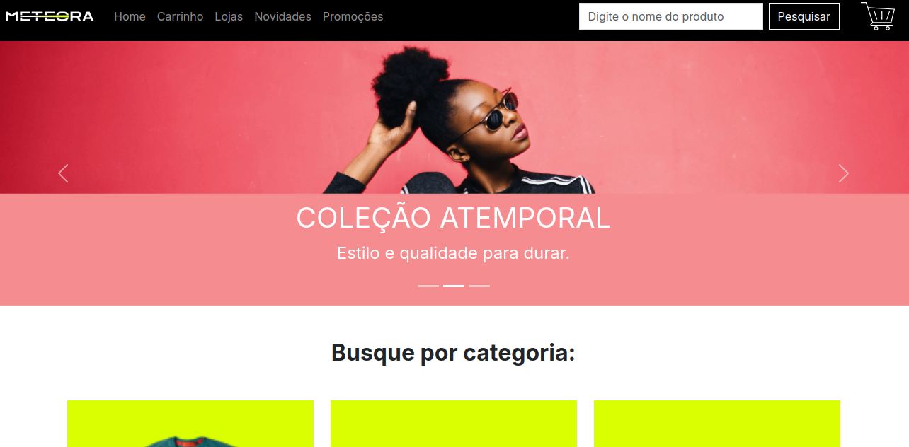
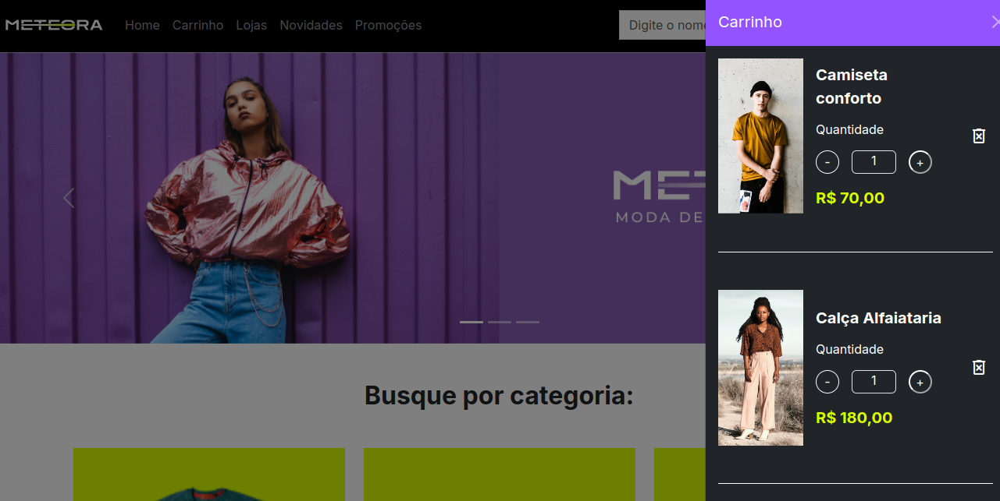

## 🛍️ Meteora

A **Meteora** é uma aplicação que simula uma loja de roupas onde o usuário pode navegar pelos produtos, adicioná-los ao carrinho, modificar quantidades, visualizar o total e finalizar a compra. O projeto tem como foco o gerenciamento de **estados globais com a Context API**, simplificando o fluxo de dados e melhorando a organização da aplicação.

 

## 🚀 Sobre o Projeto

Este projeto foi desenvolvido durante o curso da Alura:

* "React: gerencie estados globalmente com Context API"
  
A aplicação da Meteora permite visualizar a página inicial com banners e categorias, adicionar produtos ao carrinho de compras, aumentar e remover a quantidade de produtos no carrinho, visualizar o carrinho lateral a qualquer momento, ver o valor total da compra e redirecionar para a finalização da compra.

## 📚 Objetivos do Curso

**👉 React: gerencie estados globalmente com Context API**

* Identificar os conceitos da Context API no React e sua importância no desenvolvimento de aplicações;
* Aplicar a Context API para evitar o 'prop drilling', simplificando o compartilhamento de dados entre componentes;
* Criar seus próprios contextos em projetos React, permitindo o compartilhamento de estados globais, como temas e tokens de acesso;
* Depurar e solucionar problemas relacionados à Context API, usando ferramentas como o React Context DevTools;
* Combinar a Context API com o useReducer para gerenciar estados complexos.

## 🛠️ Tecnologias Utilizadas

                                        

## 🖼️ Visualização do Projeto

Uma prévia das principais funcionalidades da **Meteora**:

**🌐 Acesse o Projeto Online**

O projeto está disponível para visualização na **Vercel**. Clique no link abaixo para acessar:

**🏠 Página Inicial**

Interface com destaque para o banner e as categorias de produtos.

**🛒 Carrinho Lateral Aberto**

Carrinho acessível ao lado da tela com os itens selecionados.

**💳 Finalização da Compra**

Página para confirmação e encerramento da compra.

